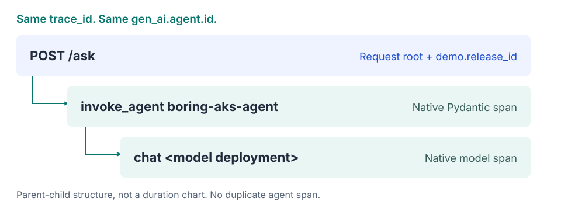

# Architecture

The application request and Foundry observability follow separate paths.
Registering the agent does not move execution, change client routing, or make
Foundry an invocation proxy.

[Open diagram full-size](assets/architecture.svg){ .figure-link }

## Request path

1. The operator uses the [CLI](https://github.com/ericchansen/foundry-aks-agent/blob/main/src/foundry_aks_agent/client.py)
   through a loopback-only, Kubernetes-RBAC-authorized port-forward.
2. The private ClusterIP service routes to FastAPI. [`POST /ask`](https://github.com/ericchansen/foundry-aks-agent/blob/main/src/foundry_aks_agent/app.py)
   requires a shared bearer token before invoking the agent.
3. The [Pydantic AI runtime](https://github.com/ericchansen/foundry-aks-agent/blob/main/src/foundry_aks_agent/runtime.py)
   makes one chat-completion call, with no tools or retries.
4. [AKS Workload Identity](https://learn.microsoft.com/en-us/azure/aks/workload-identity-overview)
   supplies pod-to-Azure credentials. The Azure OpenAI client targets the approved
   model deployment using Entra authentication, not a model API key.

The response returns the answer plus `trace_id`, `agent_id`, `release_id`,
`pod_name`, and `pod_namespace`. See the [response contract](configuration.md#http-contract).

## Telemetry path

The [telemetry provider](https://github.com/ericchansen/foundry-aks-agent/blob/main/src/foundry_aks_agent/telemetry.py)
exports native spans asynchronously to **the Foundry project's connected
Application Insights resource**. The request-scoped identity processor sets
`gen_ai.agent.id`, `gen_ai.agent.name`, and the registered
`gen_ai.agent.version` on those spans; it does not create a second agent span.

[Open trace diagram full-size](assets/trace-chain.svg){ .figure-link }

A returned answer proves neither export nor ingestion. Require the matching
request in the client output, deployed workload, project-linked Insights, and
Foundry's external-agent Traces view. The [verification guide](evidence.md)
defines the required correlation; [deployment step 6](deployment.md#6-register-and-prove-foundry-attribution)
provides the procedure.

Foundry's trace evaluation reads the same ingested telemetry through an
agent-scoped time window. It does not add a request route or move evaluation
execution into the AKS pod. See
[deployment step 7](deployment.md#7-evaluate-the-ingested-traces).

## What registration changes

The optional [administrative tool](https://github.com/ericchansen/foundry-aks-agent/blob/main/src/foundry_aks_agent/register.py)
creates or reuses an external-agent record, then reads back its `otel_agent_id`.
It must match the runtime's `OTEL_AGENT_ID`. Registration is a separate
administrative action, not a step in each request.

This repository uses [Path A, a preview integration](https://learn.microsoft.com/en-us/azure/foundry/agents/how-to/register-external-agent).
It does not provision a runtime, provide a Foundry Responses invocation endpoint,
or imply hosted-agent feature parity. [Path B](https://learn.microsoft.com/en-us/azure/foundry/control-plane/register-custom-agent)
is a different mechanism outside this repository.

## Infrastructure is not the request path

The diagram shows runtime relationships, not every provisioned Azure resource.
The [infrastructure guide](infrastructure.md#ownership-and-stages) covers ACR,
the Foundry account/project, monitoring, three separate managed identities,
staged RBAC prerequisites, and the AKS-managed node resource group.

Only the **application service** is private. The AKS API is public and
Entra/RBAC-protected; model, registry, and telemetry use public Azure endpoints.
There is no private-cluster or Private Link claim. See
[network boundaries](security.md#network-and-identity).
