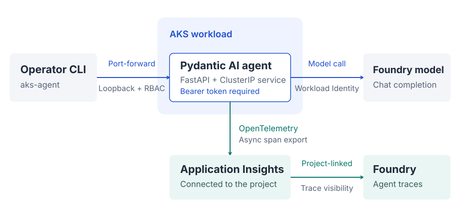

# Run on AKS. Trace in Foundry.

One Pydantic AI agent, an authenticated HTTP endpoint, and one model call per
request. Foundry adds an external-agent record and attributed traces.
**Execution stays on AKS.**

!!! important "Microsoft public preview"

    This repository uses Microsoft's
    [external-agent registration for observability and evaluation (preview)](https://learn.microsoft.com/en-us/azure/foundry/agents/how-to/register-external-agent).
    Foundry stores registration metadata and matches OpenTelemetry traces by
    `gen_ai.agent.id`; it does not host, proxy, or invoke the AKS runtime.

    Microsoft provides this preview without a service-level agreement and does
    not recommend it for production workloads. This repository implements
    registration and tracing; evaluation is outside its scope.

[Open diagram full-size](assets/architecture.svg){ .figure-link }
&nbsp; [Architecture and sources](architecture.md){ .figure-link }

<section markdown="1">

## Understand the design

Follow the [request and telemetry paths](architecture.md), then review the
[authentication and security boundaries](security.md). Path A is metadata and
observability integration, not another runtime.

</section>
<section markdown="1">

## Deploy and verify

Set up [local development](development.md), provision the
[dedicated infrastructure](infrastructure.md), then
[deploy and verify](deployment.md) an authenticated model request.

</section>

## What verification covers

The [verification guide](evidence.md) connects an authenticated model answer to
its image digest, source release, pod, stable agent ID, and native
request/agent/model trace chain. It requires the same trace in the connected
Application Insights resource and the external agent's Foundry trace view.

## Deliberately small

This is a single-operator, synthetic-data reference deployment. It has no agent
tools, conversation store, retries, or public application ingress. Path B
(APIM/AI Gateway), evaluation, document search, ingestion, and an agent web UI
are outside this repository.
See the [runtime boundaries](security.md).
